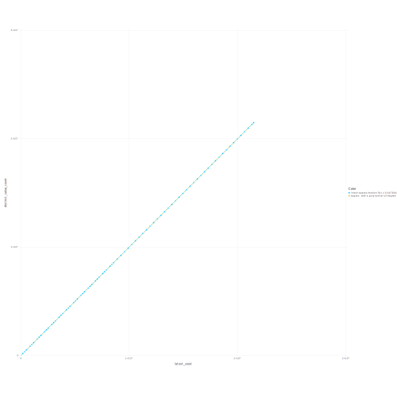
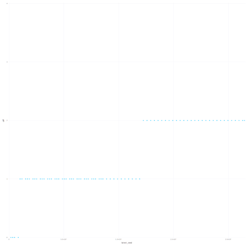

The test [program](int63.go) counts the distinct int64 values that it is possible to obtain using math/rand.Rand.Int63 as the first output of an arbitrarily seeded source. It's pretty dumb, sequentially iterating through all effectively possible seed values and checking if it's already seen the generated output. (To clarify, we are not considering entire pseudo-random sequences here, just their first elements.)

I say "effectively possible", because, as the math/rand documentation says, "Seed values that have the same remainder when divided by 2³¹-1 generate the same pseudo-random sequence". (The Seed method in math/rand replaces its parameter, the seed, with the remainder of its division by 2³¹-1 as soon as it starts.) This enables the dumb approach of the test Go program.

The [results](data/final-report.txt) are: all the 2^64 possible seeds produce 2^31 - 3 possible initial outputs; because at the beginning of Seed the range of possible seed values is reduced from 2^64 to 2^31 - 1, but two more collisions happen anyway.

The following plot shows how almost no collisions happen during the entire execution of the test program, with the plot thus being (almost) a line. The experiment was such that this must have been a graph of a nondecreasing function which grows no faster than linear, but it surprised me how it turned out to be an almost perfect line:

The following plot shows where approximately (between which seed values) do the collisions happen.

The plots were created from the experimental data using a [bit](data/fit-to-curves-and-plot/fit-plot-dat.jl) of Julia code.
